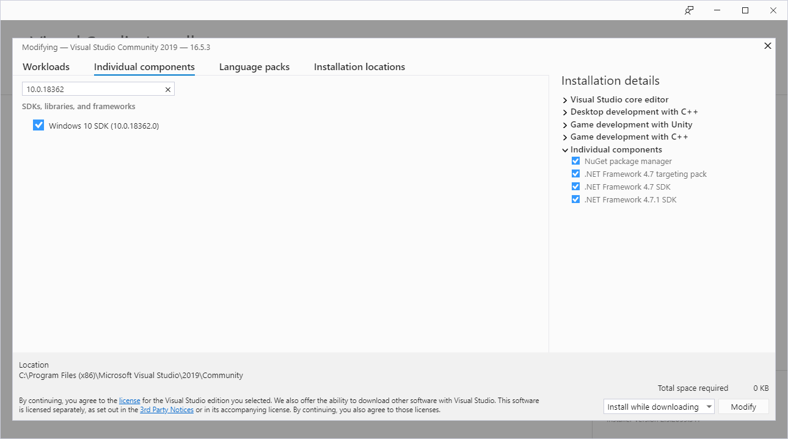
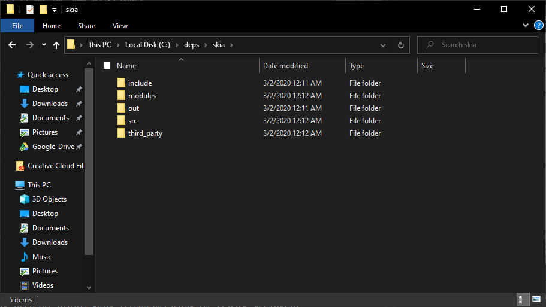
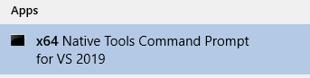
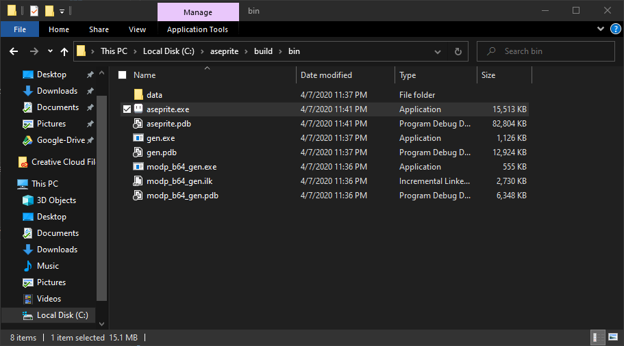

# Compiling Aseprite

A guide to compiling Aseprite (1.12.18).

- [Compiling Aseprite](#compiling-aseprite)
  - [Introduction](#introduction)
  - [Prerequisites](#prerequisites)
    - [Windows](#windows)
  - [Setting up your dev environment](#setting-up-your-dev-environment)
    - [Windows](#windows-1)
      - [Visual Studio](#visual-studio)
      - [Skia](#skia)
  - [Compiling](#compiling)
    - [Windows](#windows-2)
      - [Aseprite](#aseprite)

## Introduction

[Aseprite](https://aseprite.org/) is an open source, 2D image creation tool geared towards sprite creation. It's robust, cross-platform, and stable. Even though it's open source, the licensing restricts the redistribution of built binaries (the executable) without prior permission. So, while you are free to build it from source and even use it commercially when built from source, you need to buy it to be able to have the luxury of just downloading it pre-made.

That said, if you have the money to support the amazing developers, please do so. You pay once and have updates for life.

*Compiling* - The act of taking human readable source code and turning it into machine readable binary data with the use of programs called compilers.

**NOTE:** This guide currently covers compiling on Windows. This information is sourced from the [installation guide](https://github.com/aseprite/aseprite/blob/master/INSTALL.md) on the [Aseprite GitHub](https://github.com/aseprite/aseprite). Refer to it for the most up to date version and any extras I may have glossed over. 

## Prerequisites

The following are what are formally needed to be able to compile Aseprite. Setting them up on your system is explained in the [Setting up your dev environment](#setting-up-your-dev-environment) section.

### Windows

- Windows 10 (Windows 7 may be possible)
- [Visual Studio Community 2019](https://visualstudio.microsoft.com/downloads/)
- The [Desktop development with C++ item + Windows 10.0.18362.0 SDK](https://imgur.com/a/7zs51IT) from the Visual Studio installer
- And a [compiled version](https://github.com/aseprite/skia/releases) of the `aseprite-m81` branch of the [Skia library](https://github.com/aseprite/skia#readme).

## Setting up your dev environment

### Windows

#### Visual Studio

If you have installed Unity before, there's a very good chance you already have Visual Studio Community 2019. The only thing you will need to do is modify it to have the Windows 10.0.18362.0 SDK.

If you haven't installed Unity before, then you will need to download and install [Visual Studio Community 2019](https://visualstudio.microsoft.com/downloads/).

**Note:** This is not the same as VS Code.

To install the Windows 10.0.18362.0 SDK you will need to get to the modification menu (or simply select it during installation if you are installing). This can be done by searching for "Visual Studio Installer" and opening it up. When in the Installer, click to "Modify" Visual Studio 2019. Under "Workloads", select "Desktop development with C++" which can be found under "Desktop & Mobile".


You will then need to make sure the select the SDK under the "Individual Components" tab if it hasn't already been selected. You can search for "10.0.17763" to find it quickly.



Once you have selected the components you need, hit modify (or install) in the bottom right corner to finish the Visual Studio set up.

#### Skia

They've made it easier! No longer do you have to compile Skia anymore, you can just grab a build of it from [here](https://github.com/aseprite/skia/releases). Make sure to grab the `x64` version for Windows, unless you somehow are still running a 32 bit system. Then, make sure to extract it in `C:\deps\skia` so that the skia folder looks like this:



## Compiling

### Windows

#### Aseprite

Since Skia is precompiled, you just need to grab Aseprite sources:

Download the 1.12.18 source code from [https://github.com/aseprite/aseprite/releases/download/v1.2.18/Aseprite-v1.2.18-Source.zip](https://github.com/aseprite/aseprite/releases/download/v1.2.18/Aseprite-v1.2.18-Source.zip) and extract it to `C:\aseprite`

Once you've done that,

Open a [x64 developer command prompt](https://docs.microsoft.com/en-us/dotnet/framework/tools/developer-command-prompt-for-vs)
or command line (`cmd.exe`) and call:

```
call "C:\Program Files (x86)\Microsoft Visual Studio\2019\Community\Common7\Tools\VsDevCmd.bat" -arch=x64
```



Then do the following:

```
cd aseprite

mkdir build

cd build

cmake -DCMAKE_BUILD_TYPE=RelWithDebInfo -DLAF_BACKEND=skia -DSKIA_DIR=C:\deps\skia -DSKIA_LIBRARY_DIR=C:\deps\skia\out\Release-x64 -G Ninja ..

ninja aseprite
```

Ninja will compile Aseprite and if all goes well, you should ***not*** see a message like this:

`ninja: build stopped: subcommand failed.`

You can then find the executable inside `C:\aseprite\build\bin\aseprite.exe`.



If you do not plan to do debugging, you can get rid of all the files except for `aseprite.exe` and the `data` folder.
