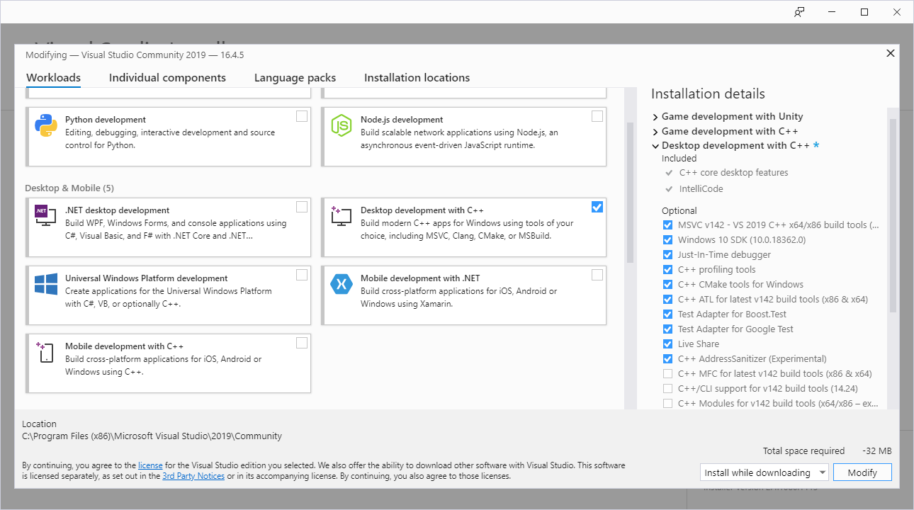

# Compiling Aseprite

A guide to compiling Aseprite (1.12.16.2).

- [Compiling Aseprite](#compiling-aseprite)
  - [Introduction](#introduction)
  - [Prerequisites](#prerequisites)
    - [Windows](#windows)
  - [Setting up your dev environment](#setting-up-your-dev-environment)
    - [Windows](#windows-1)
      - [Visual Studio](#visual-studio)
      - [Clang](#clang)
  - [Compiling](#compiling)
    - [Windows](#windows-2)
      - [Skia](#skia)
      - [Aseprite](#aseprite)

## Introduction

[Aseprite](https://aseprite.org/) is an open source, 2D image creation tool geared towards sprite creation. It's robust, cross-platform, and stable. Even though it's open source, the licensing restricts the redistribution of built binaries (the executable) without prior permission. So, while you are free to build it from source and even use it commercially when built from source, you need to buy it to be able to have the luxury of just downloading it pre-made.

That said, if you have the money to support the amazing developers, please do so. You pay once and have updates for life.

*Compiling* - The act of taking human readable source code and turning it into machine readable binary data with the use of programs called compilers.

**NOTE:** This guide currently covers compiling on Windows. This information is sourced from the [installation guide](https://github.com/aseprite/aseprite/blob/master/INSTALL.md) on the [Aseprite GitHub](https://github.com/aseprite/aseprite). Refer to it for the most up to date version and any extras I may have glossed over. 

## Prerequisites

The following are what are formally needed to be able to compile Aseprite. Setting them up on your system is explained in the [Setting up your dev environment](#setting-up-your-dev-environment) section.

### Windows

- Windows 10 (Windows 7 may be possible)
- [Visual Studio Community 2019](https://visualstudio.microsoft.com/downloads/)
- The [Desktop development with C++ item + Windows 10.0.17763.0 SDK](https://imgur.com/4Pq2Cbv)
  from the Visual Studio installer
- And a compiled version of the aseprite-m71 branch of the [Skia library](https://github.com/aseprite/skia#readme).
- [Clang: llvm](https://github.com/llvm/llvm-project/releases/download/llvmorg-9.0.1/LLVM-9.0.1-win64.exe)

## Setting up your dev environment

### Windows

#### Visual Studio

If you have installed Unity before, there's a very good chance you already have Visual Studio Community 2019. The only thing you will need to do is modify it to have the Windows 10.0.17763.0 SDK.

If you haven't installed Unity before, then you will need to download and install [Visual Studio Community 2019](https://visualstudio.microsoft.com/downloads/).

**Note:** This is not the same as VS Code.

To install the Windows 10.0.17763.0 SDK you will need to get to the modification menu (or simply select it during installation if you are installing). This can be done by searching for "Visual Studio Installer" and opening it up. When in the Installer, click to "Modify" Visual Studio 2019. Under "Workloads", select "Desktop development with C++" which can be found under "Desktop & Mobile".



You will then need to make sure the select the SDK under the "Individual Components" tab if it hasn't already been selected. You can search for "10.0.17763" to find it quickly.


Once you have selected the components you need, hit modify (or install) in the bottom right corner to finish the Visual Studio set up.

#### Clang

Clang is a C compiler. You might have heard of gcc or g++, they're both also viable compilers, however, clang from llvm is much faster which is neccesary to keep the compiles times of Skia down.

You can download it from [https://github.com/llvm/llvm-project/releases/download/llvmorg-9.0.1/LLVM-9.0.1-win64.exe](https://github.com/llvm/llvm-project/releases/download/llvmorg-9.0.1/LLVM-9.0.1-win64.exe). Make sure to install it to `C:\deps\llvm`.

## Compiling

### Windows

#### Skia

Skia is the graphical backend that lets Aseprite render everything you see on its interface. It's the core of Aseprite.

To get started with compiling, you will need to download the proper dependencies.

Download [Google depot tools](https://storage.googleapis.com/chrome-infra/depot_tools.zip) and uncompress it in `C:\deps\depot_tools`.

Open a [developer command prompt](https://docs.microsoft.com/en-us/dotnet/framework/tools/developer-command-prompt-for-vs)
or command line (`cmd.exe`) and call:

```
call "C:\Program Files (x86)\Microsoft Visual Studio\2019\Community\Common7\Tools\VsDevCmd.bat" -arch=x64
```

Then:

```
set PATH=C:\deps\depot_tools;%PATH%
cd C:\deps\depot_tools
gclient sync
```

(The `gclient` command might print an error like `Error: client not configured; see 'gclient config'`. Just ignore it.)

```
cd C:\deps
git clone -b aseprite-m71 https://github.com/aseprite/skia.git
cd skia
set GIT_EXECUTABLE=git.bat
python tools/git-sync-deps
```
(The `tools/git-sync-deps` will take some minutes because it downloads a lot of packages, please wait and re-run the same command in case it fails.)

Finally, if you've downloaded Clang, use this command:
```
set PATH=C:\deps\llvm\bin;%PATH%
gn gen out/Release --args="is_official_build=true skia_use_system_expat=false skia_use_system_libjpeg_turbo=false skia_use_system_libpng=false skia_use_system_libwebp=false skia_use_system_zlib=false target_cpu=""x64"" cc=""clang"" cxx=""clang++"" clang_win=""c:\deps\llvm"" win_vc=""C:\Program Files (x86)\Microsoft Visual Studio\2019\Community\VC"""
ninja -C out/Release skia
```

More information about these steps in the
[official Skia documentation](https://skia.org/user/build).

#### Aseprite

You will also need aseprite.

Download the 1.12.16.2 source code from [https://github.com/aseprite/aseprite/releases/download/v1.2.16.2/Aseprite-v1.2.16.2-Source.zip](https://github.com/aseprite/aseprite/releases/download/v1.2.16.2/Aseprite-v1.2.16.2-Source.zip) and extract it to `C:\aseprite`

Once you've done that,

Open a [developer command prompt](https://docs.microsoft.com/en-us/dotnet/framework/tools/developer-command-prompt-for-vs)
or command line (`cmd.exe`) and call:

```
call "C:\Program Files (x86)\Microsoft Visual Studio\2019\Community\Common7\Tools\VsDevCmd.bat" -arch=x64
```

Then do the following:

```
cd c:\aseprite
mkdir build
cd build
cmake -DCMAKE_BUILD_TYPE=RelWithDebInfo -DLAF_OS_BACKEND=skia -DSKIA_DIR=C:\deps\skia -DSKIA_OUT_DIR=C:\deps\skia\out\Release -G Ninja ..
ninja aseprite
```

Ninja will compile Aseprite and you will find the executable inside `C:\aseprite\build\bin\aseprite.exe`.
